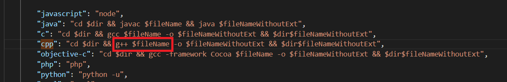

# libs_archive

### vscode - code runner

多文件编译的方法:

`setting` — `Code-runner: Executor Map`:

`gcc $fileName` 改 `gcc *.c`  ,`g++ $fileName` 改 `g++ *.cpp` 即可.

### doucment list

* #### data structure `数据结构`

  * c:
    * array2d:2维数组
    * linkstack:链栈
  * cpp:
    * linklist:链表
    * mat:2维数组
    * ring_fifo:环形队列

* #### algorithm `算法`

  * find_min_and_max:滑动窗口取最大最小值
  * find_peak_and_trough:找波峰波谷
  * bit:位操作
